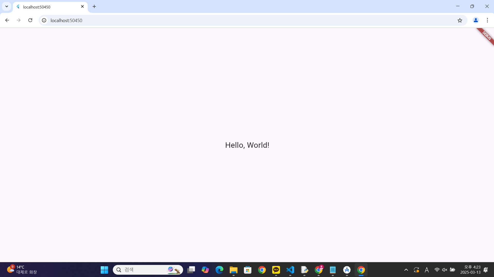

# Flutter "Hello, World!" 예제

이 Flutter 애플리케이션은 화면에 "Hello, World!"라는 텍스트를 표시하는 간단한 예제입니다.

## 📋 코드 예제
```dart
import 'package:flutter/material.dart';

void main() {
  runApp(const MyApp());
}

class MyApp extends StatelessWidget {
  const MyApp({super.key});

  @override
  Widget build(BuildContext context) {
    return const MaterialApp(
      home: Scaffold(
        body: Center(
          child: Text(
            'Hello, World!',
            style: TextStyle(fontSize: 24),
          ),
        ),
      ),
    );
  }
}


## 🖥️ 실행 결과
| 예제 실행 화면 |
|:---------------:|
|  |